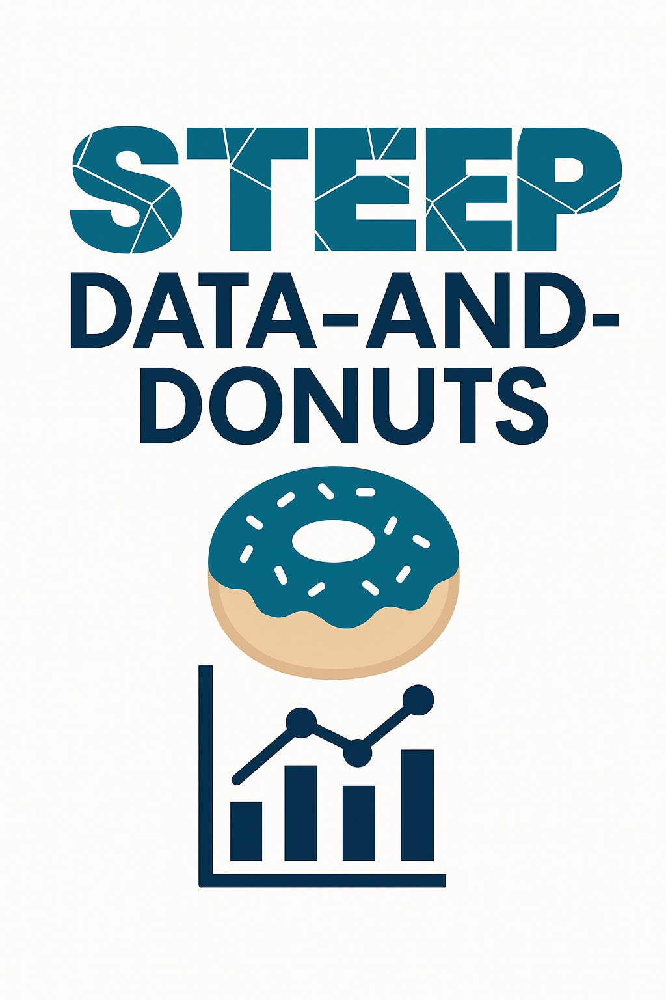

# data-and-donuts
Project STEEP DMAC workshop materials

  

### material from 14th March 2025
- agenda (agenda.pdf)
- slides for introduction, data handling, data publications, best practices with excel and jupyter notebook example (overview_handling_publications_excel_jupyter.pdf)
- slides about nice example from Justin Sankey (file_handling_justin.pdf)
- slides about Harvard dataverse and nice examples from Jahred Liddie (dataverse_jml.pdf)
- slides about study design and statistical analysis (study_design_and_statistical_analysis.pdf)
- directory including data and code for the jupyter notebook tutorial (jupyter_example):
  - contaminants_in_fish.ipynb (hands on example)
  - contaminants_in_fish_solutions.ipynb (hands on example with solutions)
  - GLENDA_PFAS_IN_FISH.csv (input data in csv format)
  - GLENDA_PFAS_IN_FISH.xlsx (input data in xlsx format)

  ### material from 31st October 2025
- agenda (agenda.pdf)
- abstract and bio from Rance Nault's seminar (abstract_bio_rance_nault.pdf)
- slides from discussion session (slides_intro.pdf)
- slides from Rance Nault's seminar (slides_rance_nault.pdf)